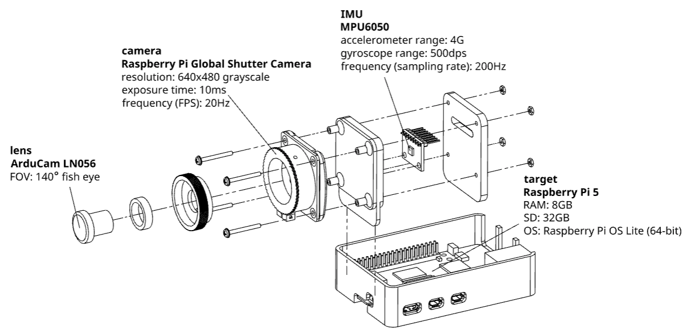
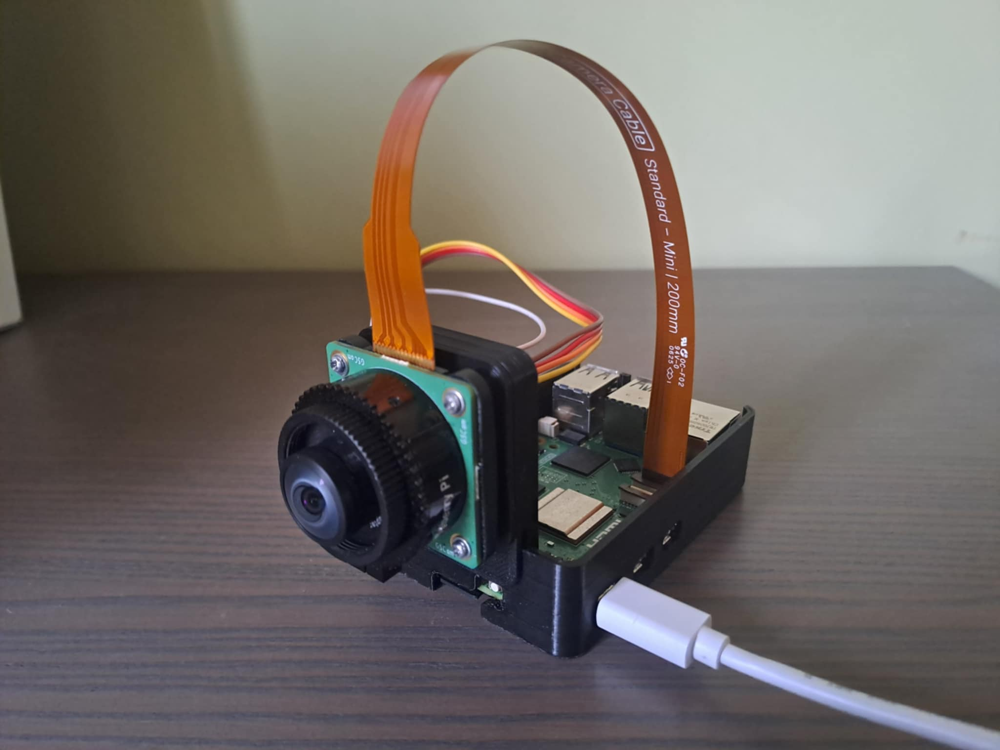
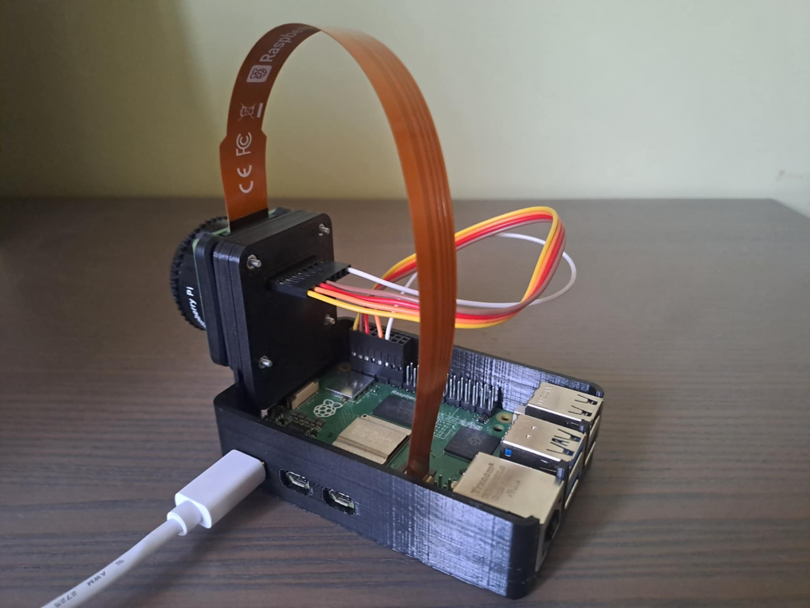

# OpenVINS example project

Basic usage [OpenVINS](https://docs.openvins.com/) that can be treated as an entry point to the topic of Visual-Inertial Odometry (VIO).
This repo consist of:

- description of minimal hardware setup,
- sample code for running VIO algorithm for [EuRoC](https://www.researchgate.net/publication/291954561_The_EuRoC_micro_aerial_vehicle_datasets) datasets (offline),
- sample code for running VIO algorithm real-time ([libcamera](https://libcamera.org/) and custom kernel module for IMU),
- sample code for recording your own EuRoC dataset.

For visualization purposes I use [visualization-3d](https://github.com/Eryk-Mozdzen/visualization-3d) software (shown in [this video](https://www.youtube.com/watch?v=xCcgdWVHCKw)).

## Hardware platform

The CAD files are available on Onshape [here](https://cad.onshape.com/documents/c44d5eb89171b718441fc3ee/w/c2b44c5b3743bec9b0dd1421/e/f362e7148cc6022fc1920843?renderMode=0&uiState=694e78af853d1bc8a945f63d).

Unfortunately, OpenVINS is mostly single threaded (only selected OpenCV operations are multi-threaded), so target platform need to be powerful enough, that's why I use RaspberryPi 5.

The camera should have typical properties needed in Machine-Vision applications:

- low resolution: 512x512, 640x480, 720x480 or 1024x512,
- constant sampling frequency (FPS): 20Hz or 30Hz
- grayscale,
- short exposure time,
- global shutter,
- fish eye lens (for indoor applications perform well).

Due to the above requirements I choose Raspberry Pi Global Shutter Camera with ArduCam lens.
RPi has built-in support for this camera.
Calibration procedure is well documented in [official OpenCV tutorial](https://docs.opencv.org/4.x/dc/dbb/tutorial_py_calibration.html).
Using `record` app I was able to capture set of images containing calibration chessboard, and then run `calibrate.py` script.
Before RPi GS Camera I also tested OV5647, but it does not work for this application (mainly due to the long exposure time and rolling shutter).

As IMU I selected MPU6050, due to the availability of this IC and Arduino-community friendliness.
Any IMU including gyro and accelerometer can be use (even separate ICs), but configuration nad wiring need to be done accordingly.
The key is to achieve flow of the gyro XYZ and acceleration XYZ data with known constant frequency.
Gyroscope and accelerometer should be synchronized (sampled at the same time).
Select sampling rate between 100Hz to 1kHz.

<table>
  <tr>
    <td valign="top" colspan="2"></td>
  </tr>
  <tr>
    <td valign="top"></td>
    <td valign="top"></td>
  </tr>
 </table>

## RPi5 configuration

### Packages & prerequisites

```bash
sudo apt install -y \
    build-essential \
    git \
    cmake \
    linux-headers-$(uname -r) \
    libboost-all-dev \
    libeigen3-dev \
    libgflags-dev \
    libgoogle-glog-dev \
    libcxsparse4 \
    libopencv-dev \
    libcamera-dev \
    python3-opencv \
    python3-numpy
```

```bash
git clone --depth 1 --branch 2.1.0 --recursive https://github.com/ceres-solver/ceres-solver.git \
    && cd ceres-solver \
    && mkdir build \
    && cd build \
    && cmake .. \
        -DCMAKE_BUILD_TYPE=Release \
        -DBUILD_SHARED_LIBS=ON \
    && make \
    && sudo make install
```

```bash
git clone --depth 1 --branch v2.7 https://github.com/rpng/open_vins.git \
    && cd open_vins/ov_msckf \
    && mkdir build \
    && cd build \
    && cmake .. \
        -DCMAKE_BUILD_TYPE=Release \
        -DBUILD_SHARED_LIBS=ON \
        -DENABLE_ROS=OFF \
        -DENABLE_ARUCO_TAGS=OFF \
    && make \
    && sudo make install
```

```bash
sudo raspi-config
# Interface Options > I2C > Enable
```

```bash
sudo nano /etc/modprobe.d/blacklist-mpu6050.conf
# blacklist inv-mpu6050-i2c
# blacklist inv-mpu6050
```

### IMU kernel module

```bash
cd mpu6050 \
    && make \
    && sudo insmmod mpu6050.ko
```

In `dmesg` you should have message `start` without errors.

### VIO apps

```bash
mkdir -p example/build
cd example/build
cmake ..
make
```

This operation should make three binaries: `record`, `vio_offline`, `vio_online`.
